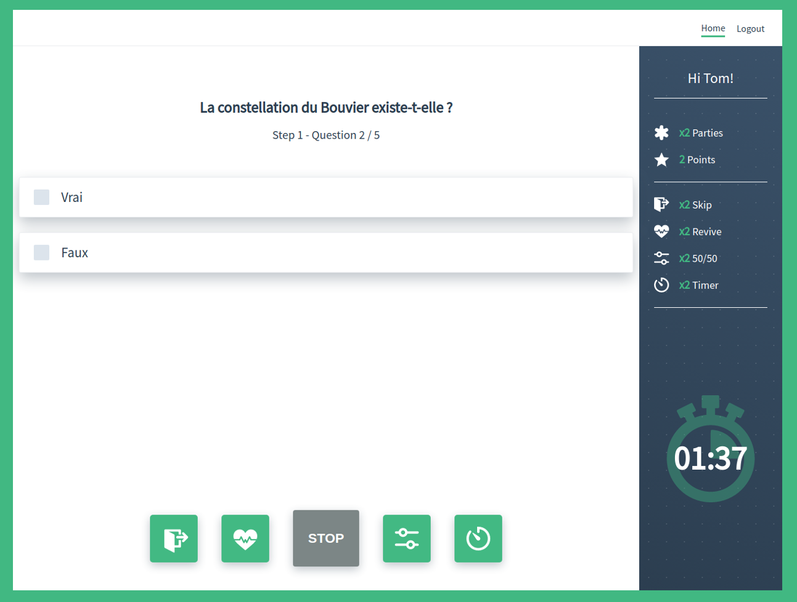

# vue-quizz

Vue Quizz is based on a React group project: ([Speedy Quizz](https://github.com/Mudh/speedy_quizz)). It became a personal "todolist like" training project transpose into a real playable quizz and I decided to adapt it with vue.js !

The backend is managed by firebase, so you need to create an account with some settings if you want to run the project. I will update the documentation soon to make it easier to install...



## Project setup

```
yarn
```

### Compiles and hot-reloads for development

```
yarn serve
```
